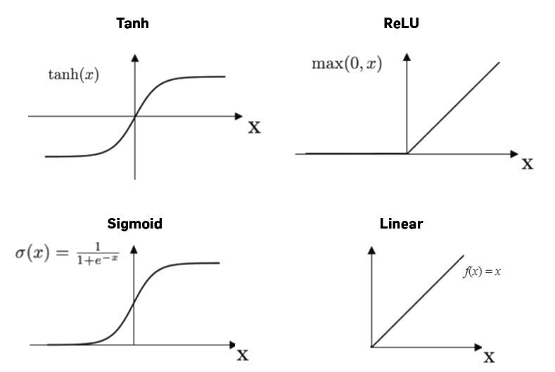
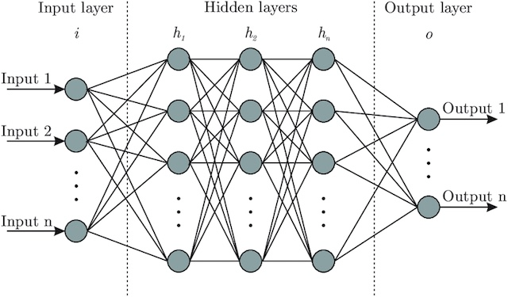
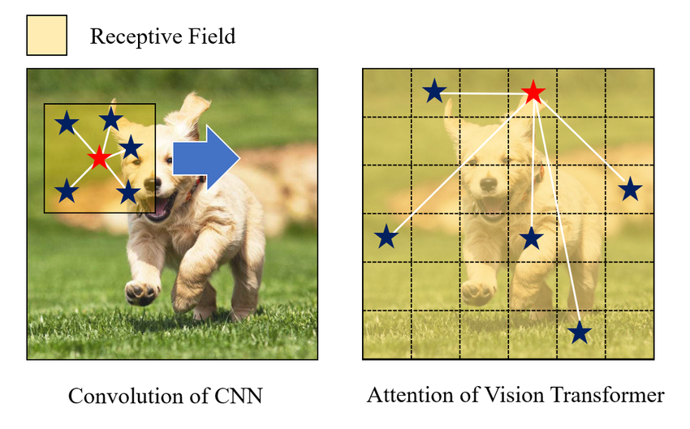

# Deep Learning Workshop  
_Maths in (deep) neural networks for image classification_

---

## 1 Why it matters  
- Photo apps tag people; self‑driving cars spot obstacles; medical scanners flag anomalies.  
- All start by converting pixels into math, then “learning” patterns automatically.  

---

## 2 Picture to numbers  
> every image is a tensor of pixel values

| image type   | tensor notation                         | shape               |
|--------------|-----------------------------------------|---------------------|
| **grayscale**| \(X \in \mathbb{R}^{H \times W}\)       | \(H \times W\)      |
| **RGB color**| \(X \in \mathbb{R}^{3 \times H \times W}\) | \(3 \times H \times W\) |

Values are usually scaled to \([0,1]\).

---

## 3 Weights & Biases  
> how the network learns

- **Weights** (\(W\)): determine how much each input contributes.  
  For inputs \(x_1, x_2\) with weights \(w_1, w_2\):  
  \[
    \text{weighted sum} = w_1 \times x_1 + w_2 \times x_2
  \]  
  A larger \(w_i\) makes \(x_i\) more influential; a negative \(w_i\) flips its effect.

- **Biases** (\(b\)): a constant added after the weighted sum, shifting the result.  
  Together:  
  \[
    z = w_1 x_1 + w_2 x_2 + b
  \]  
  Even if all inputs are zero, \(b\) lets the neuron output a non‑zero value.

---

## 4 Activation Functions  
> adding flexibility with non‑linearity

After computing \(z\), we apply \(f(z)\) so the neuron can model curves instead of straight lines:

| name     | formula          | in plain words                   |
|----------|------------------|----------------------------------|
| ReLU     | \(\max(0, z)\)   | keep positives, zero out negatives |
| Sigmoid  | \(1/(1+e^{-z})\) | squash into 0 – 1                |
| Tanh     | \(\tanh(z)\)     | squash into –1 – 1               |

---

## 5 Building a Network  
> stacking neurons into layers

### 3.1 Linear (hidden) layers  
\[
\boxed{y = f(Wx + b)}
\]  
- \(x\in\mathbb{R}^{d_{\text{in}}}\): input vector (flattened)  
- \(W\in\mathbb{R}^{d_{\text{out}}\times d_{\text{in}}}\): weights  
- \(b\in\mathbb{R}^{d_{\text{out}}}\): bias  
- \(f\): activation (see §4)
- **Layer**: many neurons side by side, all taking the same inputs.  
- **Network**: many layers in sequence.  
- Early layers learn edges; middle layers learn textures; late layers learn whole objects.

---

## 6 Architectures: CNN vs ViT  

### 6.1 Convolutional Neural Network (CNN)  
> focusing on local patterns

A small kernel \(K\) slides over the image \(X\), reusing the same weights:

\[
Y_{c_o,h,w} = \sum_{c_i,m,n} K_{c_o,c_i,m,n}\;X_{c_i,h+m,w+n}
\]

- Captures edges, corners, textures within local neighborhoods.  
- Efficient: few parameters and fast computation.

### 6.2 Vision Transformer (ViT)  
> looking at the whole image globally

1. **Patchify**: split image into \(N\) patches, flatten each to \(x_i\).  
2. **Embed**: map patches to vectors and add position info.  
3. **Self‑attention**:

   \[
   \mathrm{Attn}(Q,K,V)
   = \mathrm{softmax}\!\Bigl(\tfrac{QK^\top}{\sqrt d}\Bigr)\,V
   \]

4. **CLS token**: a vector collecting a 'summary' of the image.

### 6.3 CNN vs ViT

- **CNN**: local receptive field via kernels.  
- **ViT**: global receptive field via attention.

---

## 7 Making a Prediction – Softmax  
> turn raw scores into probabilities

Given final scores (logits) \(z_i\) for each class \(i\):

\[
p_i = \frac{e^{z_i}}{\displaystyle\sum_{j=1}^C e^{z_j}}
\]

- All \(p_i\) lie in \([0,1]\) and sum to 1.  
- The highest \(p_i\) is the predicted class.

---

## 8 Teaching the Network – Loss Functions  

### 8.1 Cross‑Entropy Loss  
Used when classes are fairly balanced.

\[
\mathcal{L}_{CE}(y,\hat y)
= -\sum_{i=1}^C y_i \,\log(\hat y_i)
\]

- \(y_i\): true label (one‑hot vector)  
- \(\hat y_i\): predicted probability  

A big penalty if the network assigns low \(\hat y\) to the true class.

### 8.2 Focal Loss  
Helps when some classes are rare.

\[
\mathcal{L}_{focal}(y,\hat y)
= -\sum_{i=1}^C \alpha_i\,(1 - \hat y_i)^\gamma\,y_i\,\log(\hat y_i)
\]

- \(\alpha_i\): weight for class \(i\) to balance frequencies.  
- \(\gamma>0\): focusing factor that down‑weights well‑classified examples.

---

## 9 Learning Loop  
> training in 5 steps

1. **Forward pass**: image → network → logits → softmax → probabilities  
2. **Compute loss**: cross‑entropy or focal  
3. **Back‑propagation**: compute gradients \(\nabla_\theta \mathcal{L}\) for all \(W, b\)  
4. **Update**:  
   \[
   \theta \leftarrow \theta - \eta\,\nabla_\theta \mathcal{L}
   \]  
5. Repeat over many images until performance stops improving.

---

## 10 Key Takeaways

- **Pixels → tensors** feed into math pipelines.  
- **Weights & biases** are the only learned parameters.  
- **Affine + activation** lets neurons learn curves, not just lines.  
- **CNNs** capture local patterns; **ViTs** capture global context.  
- **Softmax + loss** provide a clear training signal.  
- **Back‑prop + gradient descent** tune the weights and biases.  
- **Focal loss** helps when some classes are much rarer than others.
