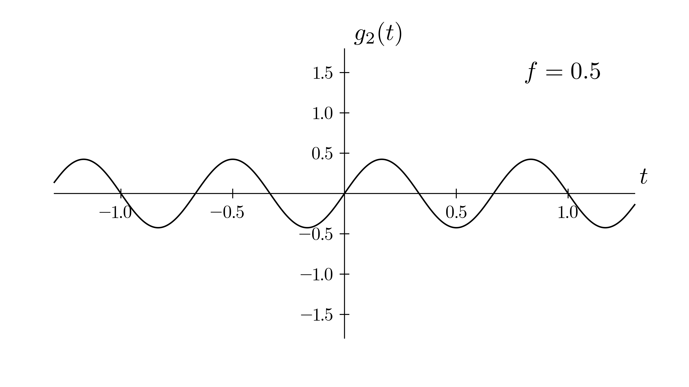

# workshop

demystifying math in software engineering

**introduction**

- aim of the workshop is to brige the gap between software engineering and math
- math is a tool, not a barrier, it plays a role in improving efficiency, performance, functionality, etc.

**a (very) brief introduction to fundamentals of mathematical notation and functions**
 
> understanding functions and their notation
$$f(x)=x^2$$
$$a\cdot f(x) \Rightarrow \text{multiplies the y-value by } a \Rightarrow \text{vertical transformation}$$

$$f(x/b) \Rightarrow \text{multiplies the x-value by } b \Rightarrow \text{horizontal transformation}$$

$$f(x-c) \Rightarrow \text{shifts graph } c \text{ units to the right} \Rightarrow \text{horizontal translation}$$

$$f(x)+d \Rightarrow \text{shifts graph } d \text{ units upward} \Rightarrow \text{vertial translation}$$


**breaking down a scary looking function**
> sample equation which gave birth to this workshop actually:

$$g(x)=\frac{4}{\pi}\sum_{n=1}^{\infty}\frac{\sin(2\pi (2n-1)ft)}{2n-1}$$

$t=\text{time}$ $f=\text{frequency}$ $n=\text{iterations}$

> what are we looking at?

1. summation $\sum$, i.e. we are dealing with a function built from multiple smaller functions added together
2. sine $\sin$ function on the inside, suggesting we are dealing with waves or oscillations
3. denominator $2n-1$ hints that terms get smaller as $n$ gets smaller, i.e. later terms will have less influence
4. $2\pi ft$ inside the sine tells us this function is time-dependent and periodic

> what can we do to break this down further?

1. ignore the sum and investigate first term, which means we'll substitute $1$ for every $n$ we "find", i.e.

$$g_{1}(t)$$

2. working this out we get

$$=\frac{4}{\pi}\cdot \frac{\sin(2\pi (2(1)-1)ft)}{2(1)-1}$$

$$=\frac{4}{\pi}\cdot \frac{\sin(2\pi (1)ft)}{1}$$

$$=\frac{4}{\pi}\cdot\sin(2\pi ft)$$

$$g_{1}(t)=\frac{4}{\pi}\sin(2\pi ft)$$

*why is the variable suddenly $t$ and not $x$? because we are dealing with a function of time*

> essentially, we have a basic sine wave function

1. the function, no matter how exactly will it look, will probably (definitely) resemble a wave


2. let's plot the graph of the second term will look like



3. combining these we get


4. skipping ahead to the tenth term function


5. smack it on top of all previous functions for each term, i.e. $=[3, 4, 5, 6, 7, 8, 9]$


**vectors (not the math kind) i.e. arrays**

> one-dimensional array, a row

1. visualizing this is very straight-forward, see below


2. in terms of expressing this in programming, again, piece of cake

``` 
one_d_array = [
    0, 0, 1, 0, 1, 0, 1, 1
]
```

> two-dimensional array, a table

1. again, nothing crazy, we expand the row of data into a table


2. programmatically speaking, maybe a little more confusing but imagine it as a table and you're good, notice the nested square brackets

```
two_d_array = [
    [0, 0, 0, 0, 0, 0, 0, 0],
    [0, 0, 1, 0, 0, 1, 0, 0],
    [0, 0, 1, 0, 0, 1, 0, 0],
    [0, 0, 1, 0, 0, 1, 0, 0],
    [0, 0, 0, 0, 0, 0, 0, 0],
    [0, 1, 0, 0, 0, 0, 1, 0],
    [0, 0, 1, 1, 1, 1, 0, 0],
    [0, 0, 0, 0, 0, 0, 0, 0]
]
```

> three-dimensional array, many tables "linked" behind one another

1. visually, imagine a screen where you want to have control over what color is being displayed apart from just controlling the state of a pixel

 

2. translating this to programming becomes a little more "messy" but with the newly gained knowledge, we should manage, e.g.
```
              ╭(first bracket, 1d)
              🢓
three_d_arr = [ 

    ╭(second bracket, 2d)
    🢓
    [   
        ╭(third bracket, 3d)
        🢓
        [0, 0, 0, 0, 0, 0, 0, 0],
        [0, 0, 1, 0, 0, 1, 0, 0],
        [0, 0, 1, 0, 0, 1, 0, 0],
        [0, 0, 1, 0, 0, 1, 0, 0],
        [0, 0, 0, 0, 0, 0, 0, 0],
        [0, 1, 0, 0, 0, 0, 1, 0],
        [0, 0, 1, 1, 1, 1, 0, 0],
        [0, 0, 0, 0, 0, 0, 0, 0],
    ],
    [
        [None,      "#74DB84",  None,       None,       None,       None,       None,       None],
        [None,      None,       "#DC75CD",  None,       None,       "#E8C11C",  None,       None],
        [None,      None,       "#DC75CD",  None,       None,       "#E8C11C",  None,       None],
        [None,      None,       "#DC75CD",  None,       None,       "#E8C11C",  None,       None],
        [None,      None,       None,       None,       None,       None,       None,       None],
        [None,      "#236B8E",  None,       None,       None,       None,       "#236B8E",  None],
        [None,      None,       "#236B8E",  "#236B8E",  "#236B8E",  "#236B8E",  None,       None],
        [None,      None,       None,       None,       None,       None,       None,       None],
    ],
]
```
3. this array is is defined as depth-first stack where by selecting the first layer we can access individual rows and colums as if we were traversing a 2d-array

**binary tree**

> what?

- data structure expressed as a figurative tree
- one root node
- nodes can only have one parent node and at most two children nodes (left and right)
- foundation for more complex structures such as binary search tree, syntax tree, etc.

```
        1
       / \
      /   \
     7     9
    / \     \
   2   6     9
      / \   / 
     5  11  5

an unbalanced and unsorted binary tree, height = 3 i.e., the number of edges from farthest node to root node (1), size = 9, i.e., total number of nodes
```

> why?

- it is an excellent entry point for many algorithms with real world applications such as
    - file system representation (that's a lie, horrible example, albeit those are trees as well)
    - compilers reading source code construct a syntax tree to represent structure of the code
    - game trees such as tic, tac, toe, where each node of a tree represents a state of the game
- allows me to demonstrate how to traverse a binary tree or a similar graph or tree structure

> algorithm (math) to programming, DFS

- starts at root and goes down as far as it can down a branch, backtracks till it finds an unexplored path, explores, etc. etc.
1.  in order to write the algorithm, let's decide how we'll store the binary tree structure in code

```
class Node:
    def __init__(self, val):
        self.data = val
        self.left = None
        self.right = None
```

- the above is python implementation of what is called linked node representation
- we chose this as it is more suitable for real world implementation where we encounter imperfect/incomplete binary trees more often than perfect ones

2. to connect the parent nodes to their children nodes, we can make a simple function

```
def connect(parent, left=None, right=None):
    parent.left = left
    parent.right = right
```

3. then, we define a couple of nodes representing the binary tree showcased earlier

```
connect(firstNode, secondNode, thirdNode)
connect(secondNode, fourthNode, fifthNode)
```

4. finally, we follow the dfs algorithm to traverse the tree

```python
def depth_first_search(root, value):
    if root is None:
        return False
    root.visited = True
    
    if root.data == value:
        return True

    left_result = depth_first_search(root.left, value)
    right_result = depth_first_search(root.right, value)

    return left_result or right_result
```

- thus the full call stack would look something like this when looking for the value 11

```
depth_first_search(1, 11)
├── depth_first_search(7, 11)
│   ├── depth_first_search(2, 11) → False
│   └── depth_first_search(6, 11)
│       ├── depth_first_search(5, 11) → False
│       └── depth_first_search(11, 11) → True
└── short-circuits here, no need to call right child (9)
```

**scary terms**
- matrix
- big-o notation
